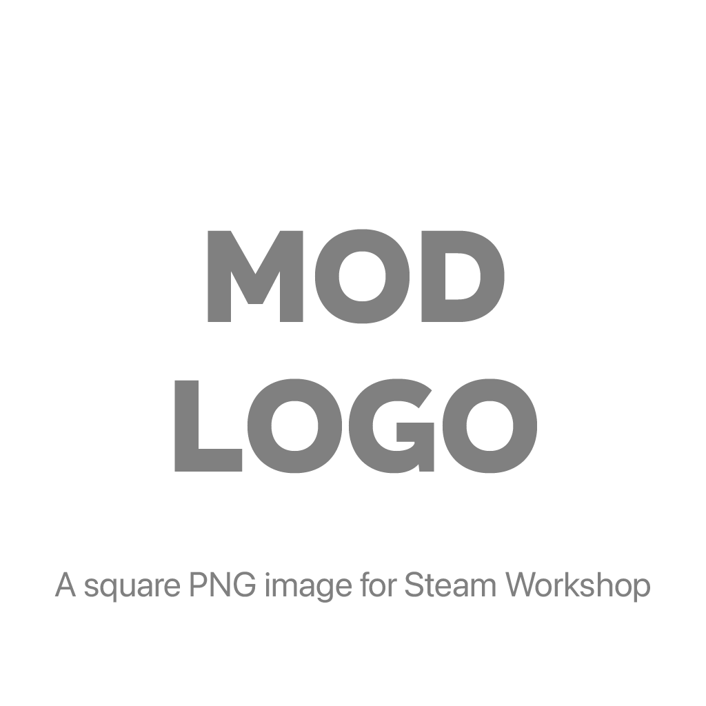

# Mod Title

## Quickstart

This Total War mod template assumes you've installed and familiarized yourself with [RPFM](https://github.com/Frodo45127/rpfm), and know the basics of [Git](https://guides.github.com/introduction/git-handbook/).

- Use the template to fork this repository. Provided you want to name your mod Packfile `my_awesome_mod.pack`, use `my_awesome_mod`, as a repo name, without the ".pack".
- Make sure you've [set MyMod folder](https://im-mortal.github.io/rpfm/chapter_2.html) in RPFM.
- In RPFM, create a new mod using *MyMod* -> *New MyMod* and name it `my_awesome_mod`. [**Save**](https://im-mortal.github.io/rpfm/chapter_3_1_1.html) the Packfile.
- Clone the repo into your game's *MyMod* folder (say, `Documents/twmodding/warhammer_2/`).
- Use *MyMod* -> *Import* to import this template's mod settings. At first, it may also import all the auxiliary files, so feel free to remove them from RPFM by invoking context menu on your Packfile in the left-hand pane, and clicking *Delete* (see [this page](https://frodo45127.github.io/rpfm/chapter_3_2_0.html) for more info). Subsequent *MyMod Imports* will import only relevant files into your Packfile.
- Start modding! You can create or import files from game files, parent mods in case you're making a submod, or just drag and drop files into your MyMod folder with your favourite file explorer (use *MyMod* -> *Import* when done). [Here's more](https://frodo45127.github.io/rpfm/chapter_3_1_2.html) about the MyMod feature.

### GitHub Workflow

This template also includes some additional GitHub Workflows that make it easier to discover issues with your scripts, tables, and loc files. To utilize them, consider these steps:

- When you've made a change in RPFM, you can use *MyMod* -> *Export* menu to export your packed files back to the git repo. Keep track of your progress and make it easier to revert changes by staging and then committing files with git. You can push the changes to GitHub to keep them safe.
- With git, maintain at least two branches, e.g.: `main` for stable mod versions and `develop` for development and testing.
- Keep a [changelog](CHANGELOG.md).
- Tag milestone commits using [Semantic Versioning](https://semver.org) pattern prefixed with `v`, e.g.: `v1.0.0`, `v2.3.5-beta`, `v0.0.8-dev`.
- Upon tagging, you may [draft a release](../releases/new) using the newly created tag, outlining the changes in the release description. Attach the pack file to binaries list. If you haven't used Packfile compression in RPFM, consider compressing it with `zip` or `7z`.

### Adapting to your needs

As with any git repo, you're encouraged to make any changes to your liking if you know what you're doing. Also, as this is stil a work in progress, you may be interested to periodically pull updates from this repo every once in a while. Finally, if you think anything could've been done or worded better, please propore your changes.

Finally, when editing this readme file, feel free to remove this quickstart section.

## Description

Mod description. Detailed, but not too elaborate.

## Features

**Highlight** main *features* of the mod:

- Each distinctive *feature* should have its own **point**.
  - Or even a **subpoint**.
- In case there are too many of them, a full list of the changes should be in a **separate file**.

## Compatibility

- Specify relevant compatibility details with other major mods.
- Known incompatibilities also listed here.

## FAQ

Frequently asked questions go here.

### Question

Answer.

### Another question

And yet another answer.

## Credits

- Kudos go here.

---

## See also

Any noteworthy links or references.
